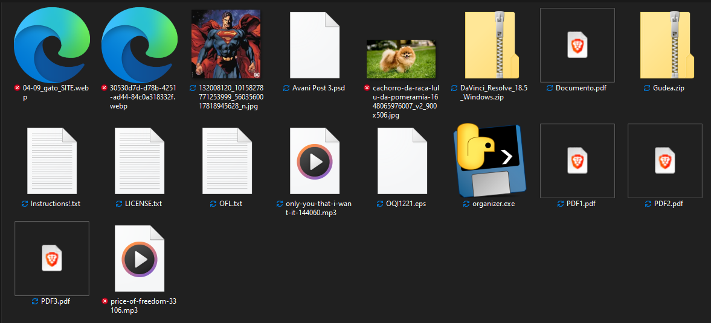
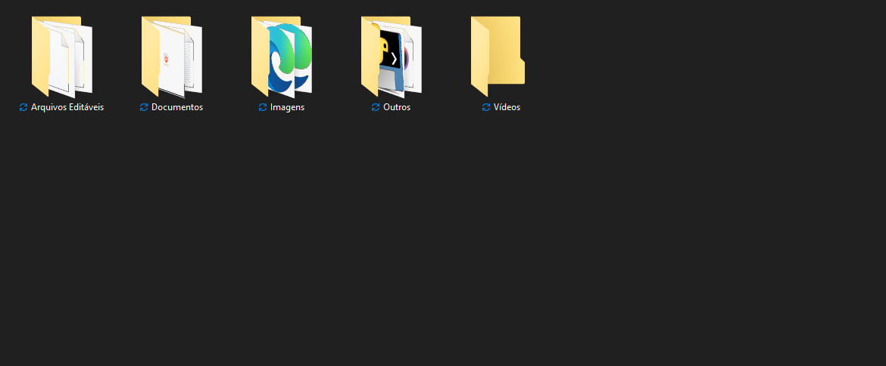

# Organizer

> Scripts de organização de arquivos para Windows.

### Linguagens e Tecnologias

<!-- 

<a href="https://github.com/romhenri/python" target="_blank"> -->
</a>
<!--

 -->

<!-- ### Colaboradores

<table>
  <tr>
    <td align="center">
      <a href="https://github.com/romhenri">
         
        
          <b>Rômulo Henri</b>
        
      </a>
    </td>
    <td align="center">
      <a href="https://github.com/j4marcos">
         
        
          <b>João Marcos</b>
        
      </a>
    </td>
    <td align="center">
      <a href="https://github.com/Teixeira007">
         
        
          <b>Vinicius Teixeira</b>
        
      </a>
    </td>
    <td align="center">
      <a href="https://github.com/Edwirgess">
         
        
          <b>Edwirges</b>
        
      </a>
    </td>
    <td align="center">
      <a href="https://github.com/romhenri">
         
        
          <b>Rômulo Henri</b>
        
      </a>
    </td>
  </tr>
</table> -->

### Autoria

<table>
  <tr>
    <td width="25%" align="center">
      <a href="https://github.com/romhenri">
         
        

          <b>Rômulo Henri</b>
        
      </a>
    </td>
    <td width="75%" align="center">
        
Projeto desenvolvido para Estudar e Praticar o uso de Python e organizar meus arquivos pessoais.
  
        Iniciado: Dia 28, de Julho (2023)
    </td>
  </tr>
</table>